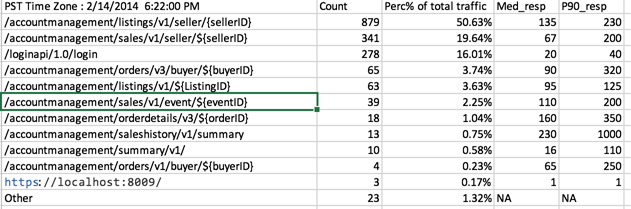

# Domain Account
Role -> myx   
Jenkins -> [domain-account](https://jenkins.stubcorp.cloud/lightning/view/Stubhub/view/domain-account/)   

## API ENDPOINT
### TAX ID 1099K
#### _/accountmanagement/taxid/v1_
* **POST**: To create the taxId info of a seller
  * Request:  
   `curl --location --request POST 'https://api.stubcloudprod.com/accountmanagement/taxid/v1/seller' \
    --header 'Accept: application/json' \
    --header 'Content-Type: application/json' \
    --header 'Authorization: Bearer ***' \
    --data-raw '{
    "taxId":"12345-1234"
    }'`
  * Response:
    * 201 CREATED
    * 400 Bad Request (INVALID_INPUT)
    * 400 Bad Request (INVALID_SELLER)
    * 500 Internal Server Error

* **PUT**: To update the taxId info of a seller
	* Request:  
	  `curl --location --request PUT 'https://api.stubcloudprod.com/accountmanagement/taxid/v1/seller' \
	  --header 'Accept: application/json' \
	  --header 'Content-Type: application/json' \
	  --header 'Authorization: Bearer ***' \
	  --data-raw '{
	  "taxId":"12345-1234"
	  }'`
	* Response:
		* 200 OK
		* 400 Bad Request (INVALID_INPUT)
		* 400 Bad Request (INVALID_SELLER)
		* 500 Internal Server Error
* **GET**: To get the taxId info of a seller
	* Request:  
	  `curl --location --request GET 'https://api.stubcloudprod.com/accountmanagement/taxid/v1/seller' \
	  --header 'Accept: application/json' \
	  --header 'Content-Type: application/json' \
	  --header 'Authorization: Bearer ***'`
	* Response:
		* 200 OK  
      	 `{
		  "taxId": "12345-1234"
		  }`
		* 400 Bad Request (INVALID_SELLER)
		* 500 Internal Server 
#### _/accountmanagement/taxid/v1/shouldShow_
* **GET**: To know if is necessary to show the taxId information
  * Request:  
  	`curl --location --request GET 'https://api.stubcloudprod.com/accountmanagement/taxid/v1/seller/shouldshow?validateNotExist=true' \
	--header 'Authorization: Bearer `
  * Query Params:  
	* validateNotExist:
      * true (C2C flow)-> the validation check if the seller has a TAX ID saved yet
      * false (MyA) -> the validation does not check if the seller has a TAX ID saved yet
  * Response:  
	`{
	"shouldShow": boolean
	}`

### Others
- /accountmanagement/payments/v1
  - update or export and get sellerpayments information from solr
- /accountmanagement/creditcardcharges/v1
  - get seller 's credit card charge list 
- /accountmanagement/creditmemos/v1
  - get seller's credimemos ,depends on sellerPayment datamodel
- /accountmanagement/cs/
  - get indy seller's credit memos ,need to check if this is duplicat with /creditmoms/v1,depends on sellerPayment data model
- /accountmanagement/saleshistory/v1
  - get sales hisotry by query solr
- /accountmanagement
	- /listings/v1/{listingId} == get listing summary by given listingId
	- /listings/v1/seller/{sellerGuId} == get My listings API
	- /listings/v1/ == get My Listings API
	- /orders/v1/buyer/{buyerGUID} == getMyOrders
	- /sales/v1/seller/{sellerGuId} == getMySales
	- POST /sales/v1/{saleId}/exception == post an "report Issue" call
	- /orders/v1/{orderId}/orderStatus ==get order status ,this is based on stub_trans 
	- /orders/v1/{orderId}/discounts == return all related discounts for this order ,internally based on used_discounts , discounts , discount_types
	－/orders/v1/{orderId}/buyerContactId ==update buyer contact id for shipping purpose
	- /summary/v1/ ==get Transactioin summary
	- /csorderdetails/v1/ ==get order details for CS 
	- /cssales/v1/ ==get sales details for CS
	- /sales/v1/event/{eventId} ==get all sales under a given event ,this is used by CS
	- /sales/v1/event/internal/{eventId} ==get all sales under a given event (with an extended property list), this is used by SIP and MM
	- /emails/v1/ ==get emails api 
	- /orders/v1/{orderId}/substitutions/ ==create a SUB order ,based on stubTrans 
	- /fulfillmentspecification/v1/ == get fulfillment specification
	- /deliveryspecification/v1/ == get delivery specification
	- /cssaledetails/v1/ ==get CS sales details
- /accountmanagement/invoice/v1/
  - depends on view MYACT_INVOICE_VW_01 and sellerPayments to generate invoice response ,can return PDF format

###AO###

- unified myaccount----> ACTM
	- /accountmanagement/taxid/v1 ==> input taxid
	- /listings/v1/seller/{sellerGuId} ==> my listings
	- /orders/v1/buyer/{buyerGUID} ==> my orders,this has been deprecated to user getMyOrders v3 api
	- /sales/v1/seller/{sellerGuId} ==> my sales
	- /accountmanagement/payments/v1 ==> my payments
	- POST /sales/v1/{saleId}/exception ==> post an report issue call
	- /accountmanagement/saleshistory/v1 ==> get sales history
	- /summary/v1/ ==>get Transactioin summary
	- /accountmanagement/invoice/v1/ ==>depends on view MYACT_INVOICE_VW_01 and sellerPayments to generate invoice response ,can return PDF format
	- /orders/v1/{orderId}/discounts == return all related discounts for this order ,internally based on used_discounts , discounts , discount_types
	- /accountmanagement/creditcardcharges/v1 ==>get seller 's credit card charge list
	- /accountmanagement/creditmemos/v1 ==> get seller's credimemos ,depends on sellerPayment datamodel

- CS ----> ACTM
	- /csorderdetails/v1/ ==get order details for CS
	- /cssales/v1/ ==get sales details for CS
	- /sales/v1/event/{eventId} ==get all sales under a given event ,this is used by CS
	- /orders/v1/{orderId}/substitutions/ ==create a SUB order ,based on stubTrans
	- /orders/v1/{orderId}/orderStatus ==get order status ,this is based on stub_trans
	- /accountmanagement/cs/==> get indy seller's credit memos

- Payment
	- TBD

###API USAGE###
:
